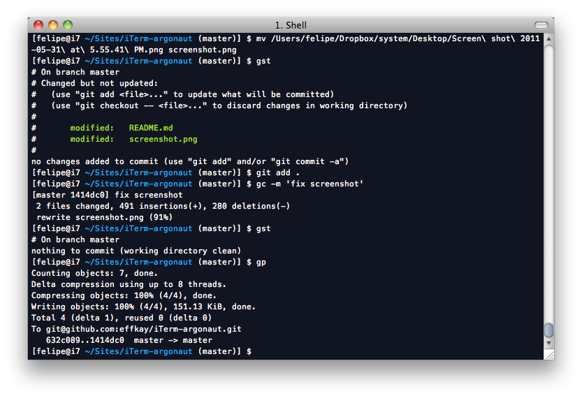

# Argonaut Theme for iTerm

I really love the Argonaut Theme by David Lee (unfortunately, no "official" link seems to be working at this time), and after porting it to vim I also felt like having it in iTerm, so here it is.

